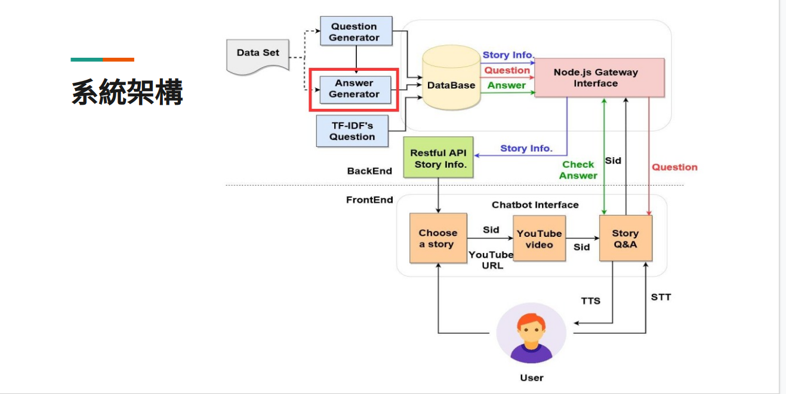
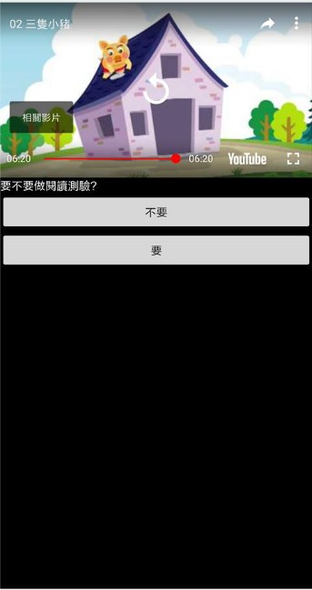
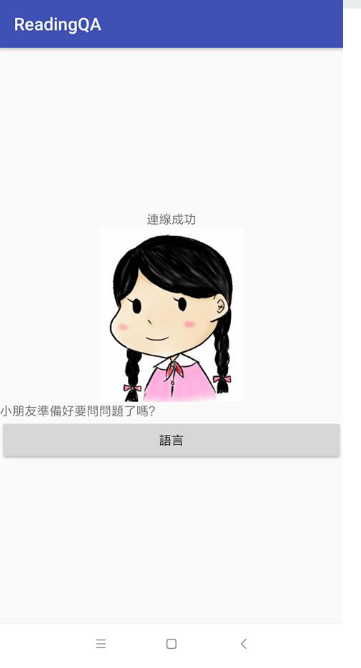

# Reading QA APP

此專案為參加 2018 軟體創作達人暑期成長營作品的 APP

## 架構圖

## Select Story Name

- We use spinner th choose story name children want to watch in YouTube.
- Those story names are gotten by using Restful API.

## YouTube

- We use YouTube API to create video.

## Model QA

- We use Socket IO to chat with children.

